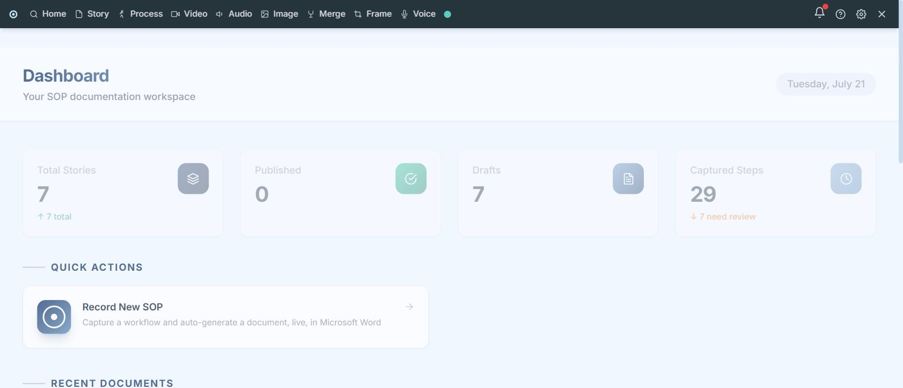
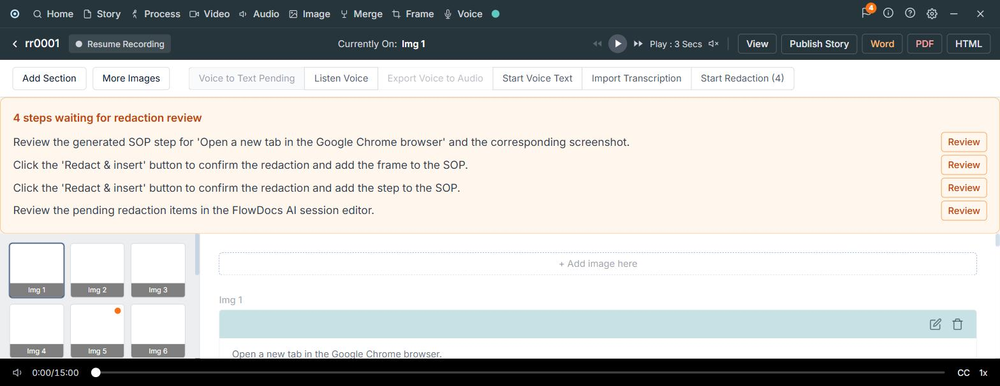

# FlowDocs AI

Turn a live workflow into a Standard Operating Procedure automatically.
Start a recording session and FlowDocs AI opens a real Microsoft Word
document, watches your screen, and writes an instruction + screenshot into
that document for every meaningful action you take — while you're still
doing it.

Sensitive frames (passwords, account numbers, personal data) are held back
for a redaction review before anything is written. Voice notes attach to
whichever step you just did. Because the document is genuinely open in Word
the whole time, you can keep editing it natively — reorder sections, add
tables, add hyperlinks — while new steps keep appending underneath. Every
session auto-saves with version history, and a finished SOP exports to
PDF/DOCX/HTML/Markdown or publishes straight to SharePoint or Confluence.


*The dashboard: total SOPs, how many are published vs. still drafts, and how many captured steps are waiting on redaction review.*


*A session in progress — the left filmstrip is every screenshot captured so far, the main panel shows the AI-written instruction for the current step, and flagged frames sit in the redaction review queue up top until approved.*

## Example use case

> A support engineer needs to document "how to reset a user's password" so
> the rest of the team can follow the same steps without asking them
> directly.

1. They click **Record New SOP**, name it, and FlowDocs AI opens a blank
   Word document and starts watching the screen.
2. They perform the reset for real — open the admin console, search the
   user, click reset, confirm. After each meaningful screen change, an
   instruction + screenshot appears in the Word doc automatically
   ("Search for the user by email", "Click Reset Password", ...).
3. The admin console happens to show the user's email and an account ID on
   screen — FlowDocs AI flags that frame and holds it in a **redaction
   review** queue instead of writing it in directly.
4. The engineer reviews the flagged frame, blacks out the account ID, and
   approves it — now it's inserted.
5. They add a quick spoken note ("if the user isn't found, check they're
   using their work email") — it gets transcribed and attached under the
   right step.
6. They stop recording, skim the generated SOP in Word (still just a Word
   document — they fix a typo directly in Word), and publish it to
   Confluence for the team.

See [`docs/USE_CASE.md`](docs/USE_CASE.md) for a longer walkthrough with
screenshots of the story library and session view.

## Architecture

Recording and document editing happen entirely on the backend (a browser
tab can't drive the desktop Word app or see the whole screen); the frontend
is a control panel, not the editing surface.

- **Backend:** FastAPI + SQLite (`/backend`)
  - `services/word_automation.py` — drives Word via `pywin32` COM automation
    on a single dedicated thread (COM objects aren't thread-safe across
    threads); every FastAPI request bridges in via
    `asyncio.wrap_future`.
  - `services/screen_monitor.py` — continuous full-screen capture (`mss`) +
    OpenCV frame-diffing, so only stabilized, meaningfully-different frames
    get kept.
  - `services/ai_layer.py` — two Gemini calls per kept frame, on separate
    models/quotas: a vision pass reads on-screen text, identifies UI
    elements, and flags sensitive info + redaction boxes; a text-only pass
    writes the SOP instruction from what the vision pass extracted.
  - `services/recording_session.py` — wires the two together: significant
    frame → analysis → auto-insert into the live Word doc, or queue for
    redaction review if flagged sensitive.
  - `services/versioning.py` — filesystem snapshots of the `.docx` per
    project, with restore.
  - `services/export_service.py` — DOCX is a file copy, PDF/HTML go through
    Word's own exporter, Markdown walks the `.docx` with `python-docx`.
  - `services/publishers/` — pluggable publish targets. SharePoint (Graph
    API + MSAL device-code login) and Confluence (REST API) are wired up;
    ServiceNow and Salesforce are stubbed behind the same interface until
    credentials are configured.
  - `services/transcription.py` — faster-whisper (local, open-source) for
    voice notes.
  - `services/redaction.py` — Pillow blackbox/blur, applied only after user
    review.
- **Frontend:** Next.js 14 + React + Tailwind (`/frontend`) — session
  control panel: start/stop/resume recording, pending-redaction review
  queue, version history, export/publish. No rich-text editor; Word is the
  document.

Word (the live `.docx`) is the source of truth for document content.
SQLite is a bookkeeping/index layer on top of it — the review queue,
version pointers, voice-note routing, publish history — never used to
reconstruct the document itself.

## Setup

### Backend

Requires **Windows with Microsoft Word installed** (COM automation).

```bash
cd backend
python -m venv .venv && .venv\Scripts\activate
pip install -r requirements.txt
uvicorn app.main:app --reload --port 8000
```

`backend/.env`:
```
GEMINI_API_KEY=...
GEMINI_VISION_MODEL=gemini-flash-lite-latest   # optional, this is the default -- OCR/UI-detection pass
GEMINI_TEXT_MODEL=gemini-3-flash-preview       # optional, this is the default -- instruction-writing pass
```
Split into two models so the two Gemini calls made per captured screenshot draw from separate
free-tier quota buckets instead of both competing for the same one (see
`services/ai_layer.py`). Model availability and quota vary per API key/account and change over
time -- if either default 404s or 429s for your key, list what's actually usable with:
```bash
python -c "from google import genai; import os; from dotenv import load_dotenv; load_dotenv('.env'); \
[print(m.name) for m in genai.Client(api_key=os.environ['GEMINI_API_KEY']).models.list()]"
```

Optional publish credentials (unset ones report "not configured" rather
than failing):
```
SHAREPOINT_TENANT_ID=...
SHAREPOINT_CLIENT_ID=...
SHAREPOINT_SITE_ID=...
SHAREPOINT_DRIVE_ID=...

CONFLUENCE_BASE_URL=...
CONFLUENCE_EMAIL=...
CONFLUENCE_API_TOKEN=...
CONFLUENCE_SPACE_KEY=...
```

### Frontend
```bash
cd frontend
npm install
npm run dev
```
Visit `http://localhost:3000`. Talks to the backend at
`http://localhost:8000` by default (override with `NEXT_PUBLIC_API_BASE`).

## Validated

`backend/scripts/` has standalone spikes/smoke tests run against the real
Word COM automation, screen monitor, Gemini analysis, and versioning
pipeline (not part of the app, just how this was verified end-to-end
before wiring the FastAPI layer around it). The full pipeline — start
session → real screen changes captured and filtered → Gemini-generated
steps inserted into a genuinely open Word document → sensitive frame
correctly queued for review → DOCX/PDF/Markdown export — has been
exercised through the live HTTP API, not just unit-level.

## Known gaps / next steps

- **Full-screen capture is a privacy gap.** `mss` grabs the whole screen,
  not just a target app. A capture-region selector and a visible
  recording indicator are worth adding before this leaves your machine.
- **Single active recording session at a time** (one Word COM instance,
  one screen monitor thread) — multi-project concurrent recording is out
  of scope for now.
- **Gemini Vision is a cloud dependency.** `ai_layer.analyze_screenshot()`
  is deliberately the only entry point with a provider-agnostic return
  type, so a local/open-source vision-language model can be swapped in
  later without touching the rest of the pipeline.
- **ServiceNow/Salesforce publishing are stubs** — same `Publisher`
  interface as SharePoint/Confluence, just need credentials + the actual
  API calls filled in (`services/publishers/servicenow.py` /
  `salesforce.py`).
- **DB step order can drift from Word's real order** once you manually
  reorder content inside Word — bookmarks still resolve correctly (they
  move with their content), but the filmstrip/review-queue's displayed
  order is a capture-time index, not a live mirror of the document.
