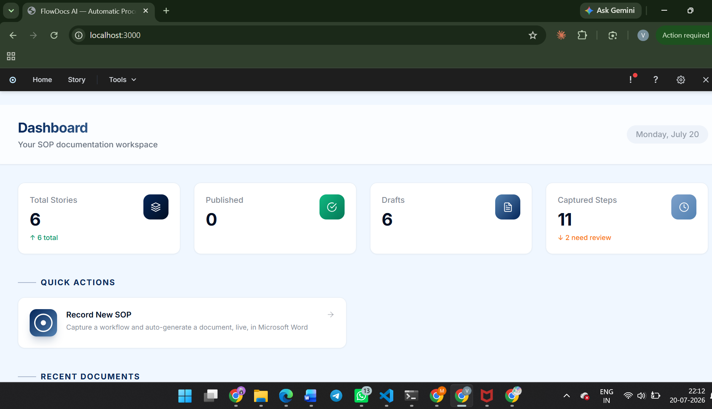
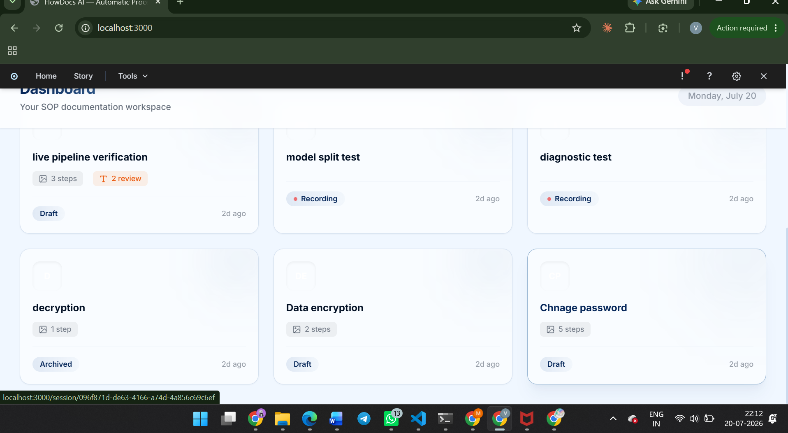

# Use case: documenting a password-reset procedure

This walks through a single end-to-end session, from an empty dashboard to
a published SOP, so you can see what each screen is for.

## 1. Start from the dashboard

The dashboard tracks every SOP you've recorded — total stories, how many
are published vs. still drafts, and how many captured steps are waiting on
redaction review.

Clicking **Record New SOP** names the new document and immediately opens it
in Microsoft Word while FlowDocs AI starts watching the screen.

## 2. Perform the workflow

The engineer does the actual password reset in the admin console: opens
the user search, finds the account, clicks reset, confirms. After each
meaningful screen change, FlowDocs AI:

1. Captures the frame once it's stopped changing (`screen_monitor.py`).
2. Sends it to Gemini for a vision pass — reads the on-screen text,
   identifies what's being clicked, and checks for sensitive info.
3. Writes the resulting instruction + screenshot into the live Word
   document, right where the cursor left off.

If a frame contains something sensitive (an account ID, an email, a
document reference), it's held out of the document entirely and queued for
manual redaction review instead of being inserted automatically.

## 3. Review, redact, and add a voice note

Flagged frames show up as pending review items. The engineer opens each
one, draws/adjusts the redaction box over the sensitive area, and approves
it — only then does it get inserted into the document. A quick voice note
("if the user isn't found, check they're using their work email") gets
transcribed and attached to the step it was recorded next to.

## 4. Manage the growing library

As more SOPs get recorded, the story library shows all of them — drafts
still being worked on, ones actively recording, and ones already
published — searchable by name and filterable by status.

## 5. Stop, polish, and publish

Recording can be stopped and resumed at any point without losing anything.
Because the document is a real, open Word file the whole time, the
engineer can also just edit it directly in Word — fix a typo, reorder a
section, add a table — and those edits stick. When it's ready, **Publish
Story** pushes it to Confluence (or SharePoint, or exports to
PDF/DOCX/Markdown for anywhere else).

The end result: a written, screenshotted SOP that took no extra writing
time beyond doing the task once.
